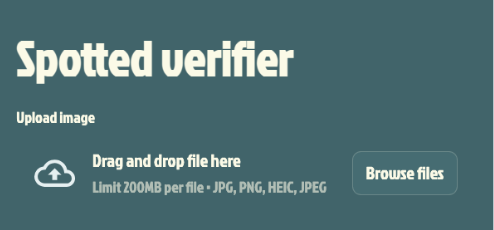
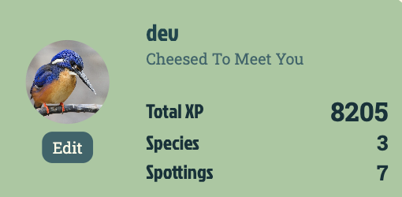
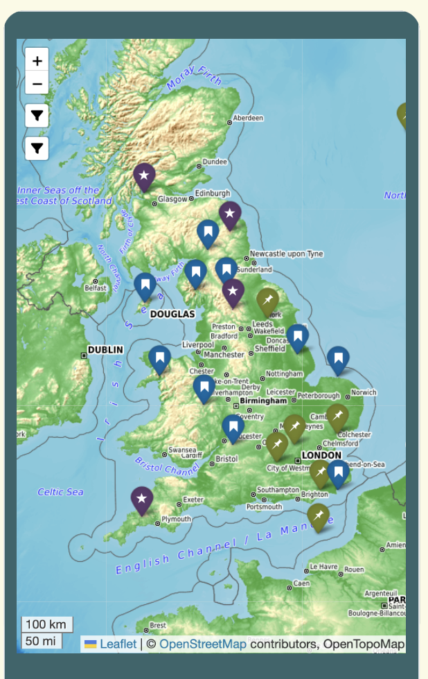
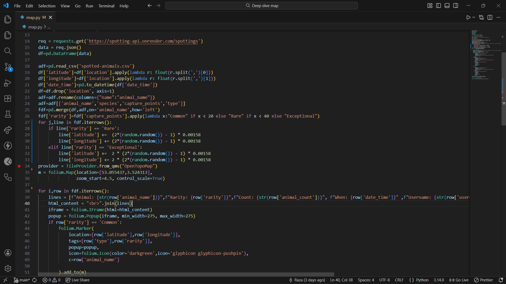

# Deep-Dive
Week 8-9 Project Beta Overview

# Spotted Application
Spotted is a web based application built to encourage people of all ages and backgrounds to explore the natural world around them. 

This application represents the middle ground between an association of professional and avid animal watchers and a fun, interactive game designed to ease people into this hobby.

The game relies on rewards for finding specific animals and certain unique species, allowing them to gain points based on animal rarity and completing achievements.
## 1. How To Use
You can access the application via the link [here](https://spotted-app.netlify.app).

When opening the application for the first time, users are invited to create a new profile. With the addition of a username, password and email address, they gain full access into every part of the game.
### 1.1 The Homepage & Navigation Overview
After logging in, you will be shown two main buttons:
-  __Sumbit Sightings__ will take the user to a page allowing them to upload photos of animals they have seen in the wild.
- __View the Map__ redirects the user to the map page.

Underneath these two buttons is a section detailing the daily and weekly challenges for the user. This is currently under construction and may not be readily available at time of reading this.

The __Navigation Bar__ located at the top right of the screen drops down giving the user three more locations to go to:
- __My account__ is the page dedicated to the user's profile, where they can edit their details and look at their most recent sightings.
- __About us__ leads to a short introduction of the four developers of this project and what our goals are.
- __Leaderboards__ will display the top users based on earned xp from their photographs and recently earned achievements.

### 1.2 Submitting Spottings

When entering the page to submit your spots, an external application will wake up and ask you to enter a photo. This pulls up a standard file selector so that you are able to load any pictures stored on your device.

After the picture is uploaded, the ML Chatbot will compare the image to every animal in our database and determine which one you have photographed. Alongside this, it will tell you how many of the animal is in the picture before requiring your username as confirmation that you would like to submit the image; and a pair of coordinates entered for the location at which you spotted the animal(s) in order for the map to work correctly.

Once the image is successfully stored in the database, you will then be redirected to your account page and will be able to see how many points you have earned.

### 1.3 How The Points System Work
Your total points will originate from one of three locations:
1. Firstly, completing daily and weekly challenges will earn you points once the construction of this element is complete. Though in the meantime you will not be able to gain points this way.

2. Every time you upload a photo, you are given points based on a variety of factors:
- To begin, each animal in the database has a points value ranging from 1 to 50.
    - Common animals will be worth few points; for example _rabbits_ and _woodpigeons_ are worth only one point. Rarer animals are worth more points; the _capercaillie_ and _alcathoe bat_ will both reward the player 50 points each.
- When a picture contains multiple of a single animal you will receive a __pack bonus multiplier__ which is either 1.1 for animals commonly seen in groups, 1.35 for animals sometimes seen in groups and 2 for solitary animals.
- The pack bonus is raised to the power of however many more animals there are than the expected one. 
    - One European Badger will award 18 points, finding two will reward 24.3 points, and getting a photograph of three will grant you 32.805 points because the multiplier for badgers is 1.35.
- This multiplier allows balance in the game, since rarer animals should not immediately be superceded by large groups of common animals.
    - e.g. Finding 20 pigeons will only award the player 6.73 points as to not disrupt the rewards of finding rarer animals.
3. The final way the user will gain points is through achievements.
- One set of achievements rewards points based off of the total number of spottings a user makes.
- Another set rewards points for finding a certain number of rare animals.
- The most extensive set of achievements are based on the family of the animals that the user can photograph, rewarding points by how many spottings of certain groups (such as deer, weasels or owls) the user has.

### 1.4 The Account Page

On the account page, you will be able to see your statistics; detailing not only your total points, but how many unique species you have found and how many spottings you have made.

Below the statistical overview you will be able to see all of your spottings, showing the image alongside the animal name and the date at which it was taken.

Further below is the achievements tab, where you see all achievements in the game. Check marks appear next to achievements that you have acquired.

In a similar vein, the "My Zoo" section shows every animal available to be captured, displaying ticks once you have a spotting containing one.
### 1.5 Account Customisation
When editing your account, you can customise three pieces of information. Internally, you are able to change your password at any time. 

You can also customise your profile picture with a set of pictures that are obtained by submitting spottings of certain animal families.

Titles are given for every achievement you have unlocked. 
### 1.6 View The Map

The user is able to see the a map which will display pins of every uploaded Spotting. They are coloured green for common animals, blue for rarer animals and purple for exceptionally rare animals worth over 40 points each.

For uncommon animals, the point on the map they were photographed at will be randomly selected within a range of 500 metres to 1 kilometre. This is to prevent people from flocking to these locations and disrupting wildlife that is uncommon.

Filters exist on the map so you can also reduce clutter on your screen. You are able to filter two ways:
- By rarity - you can select only common, rare or exceptional animals to show up.
- By type - you can select between mammals, birds, amphibians and reptiles as the only ones showing up.

### 1.7 Leaderboard
Two different leaderboards are available right now. One is ordered by the total points each user has achieved through their uploaded spottings within the current month. The other displays overall total values for each user, including the points they have gained through achievements.
## 2 Technologies Used
### 2.1 Frontend Technologies
- HTML for web layout
- CSS for stylisation
- JavaScript for interactivity and reaching the API to fetch data
    - Libraries such as Express and Jest were used to provide web frameworks and testing features worked as intended
### 2.2 Map Application Technologies
- Python libraries for dispaying coordinates on interactive maps
    - For example, we used Pandas to help randomise the coordinates of rarer animals
- Streamlit for deploying the services independently of the final product
### 2.3 Uploading Image Application Technologies
- Python for building the prompts and sending requests
- OpenAI for the chatbot to recognise animals from our database
### 2.4 Backend Technologies
- JavaScript for transforming requests and responses from the API to the database, with libraries such as
    - Postgres for sending SQL queries
    - Express and Node js as a backend framework 
    - Bcrypt for safely storing encrypted passwords
    - JSONWebToken for ensuring users remain logged in when changing between web pages
- SQL for updating and fetching information from our databases
### 2.5 External Hosting
- Netlify is the main application's host, where users are able to reach the application without having the front end run locally
- Supabase for hosting our databases
- Render for hosting our API, allowing HTTP requests to be sent without the backend being run locally
- GitHub for version control and collaborative work
## 3 Processes
### 3.1 API Requests
Every text that begins with a colon denotes a parameter which can be changed to give different results
- /users
    - /register - POST request that registers user accounts
    - /login - POST request that checks credentials and logs user in
    - / - GET request which pulls all users and sorts by their total points
    - /id/:id - GET request which returns information on a user by their ID
    - /pics/:id - GET request which returns all available profile pictures the user can equip
    - /pics/:id - PATCH request which replaces the old profile picture with the new profile picture
    - /title/:id - GET request which returns all available titles the user can equip
    - /title/:id - PATCH request which replaces the old title with the new title
    - /update/:id - PATCH request that updates the user's old password with a new encrypted password
    - /zoo/:id - GET request which returns all animals that the user has uploaded sightings of
    - /achievements/:id - GET request which returns all achievements which the user has acquired
- /spottings
    - / - GET request which loads all information about all spottings
    - /id/:id - GET request which returns one spotting by its ID
    - /filter/user/:id - GET request which returns all spottings by a certain user (by ID)
    - /filter/type/:type - GET request which returns all spottings by a certain type (e.g. mammal, bird, reptile ...)
    - /new - POST request which creates a new spotting and uploads it to a database
- /family
    - /update/:id - PATCH request which updates the profile picture image associated with the families
- /challenges
    - / - GET request which returns all challenges in our database
- /animals
    - / - GET request which returns all animals
    - /id/:id - GET request which returns all information on a specific animal
    - /new - POST request which adds a new animal to the database
    - /update/:id - PATCH request which updates the animal's zoo image associated with each animal
- /achievements
    - / - GET request which returns all achievements
    - /id/:id - GET request which returns information about a specific achievement (by ID)
    - /check/:id - GET request which takes in the user's ID and checks any achievements which the user has achieved

## 4. Challenges Faced
### 4.1 Uploading a Photo

Above is the code we used to upload images and the necessary information for a user's spotting. This was a challenge for us due to the translation from an AI's response determining the animal into a JSON object which is then to be sent as a request to the API to update the database.

Our biggest issue also depended on the display for the user, as many problems arose with the user interface's colour scheme.

Another issue came with generating the map. This was a challenge which was solved after several tests and preview images. The problems involved the pins, which were not displaying the correct information at first.